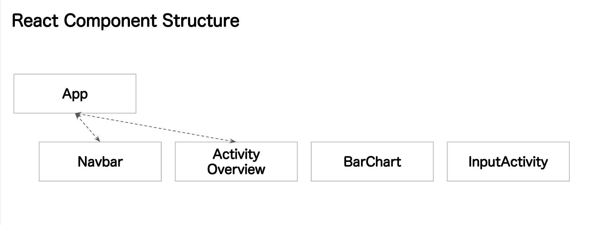

#Introduction

- App Name: Fitness
- App Description: You can log your workout for today
- App Target User: hobby athletes
- Stories:
  As a User,
  Given that I am at “activity log page”,
  I can overview my recent activity log in descended order,
  so that I can image in my head how much I should add workout.
  As a User,
  Given that I am at “activity log page”,
  I click “Log Workout” then I can input both type and time length of workout for today.
  As a User,
  Given that I am at “Input page”,
  I click “View Activity” then I can go back to “activity log page”.
  As a User,
  Given that I am at “activity log page”,
  I click “Graph” then I can view activity log in bar graph.
  As a User,
  Given that I am at “graph page”,
  I click “View Activity” then I can go back to “activity log page”.

#MVP
In order to validate core features with sample users,
create features in mock-up env for test use.

\*Features for 2 days

- log any workout
- display activity log
- display graph

\*Deploy one set of Workflow
overview activities >> click input workout >> input workout >> save workout >> D3 shows activity history in bar graph

#Technology Used

- D3, React, React Bootstrap

